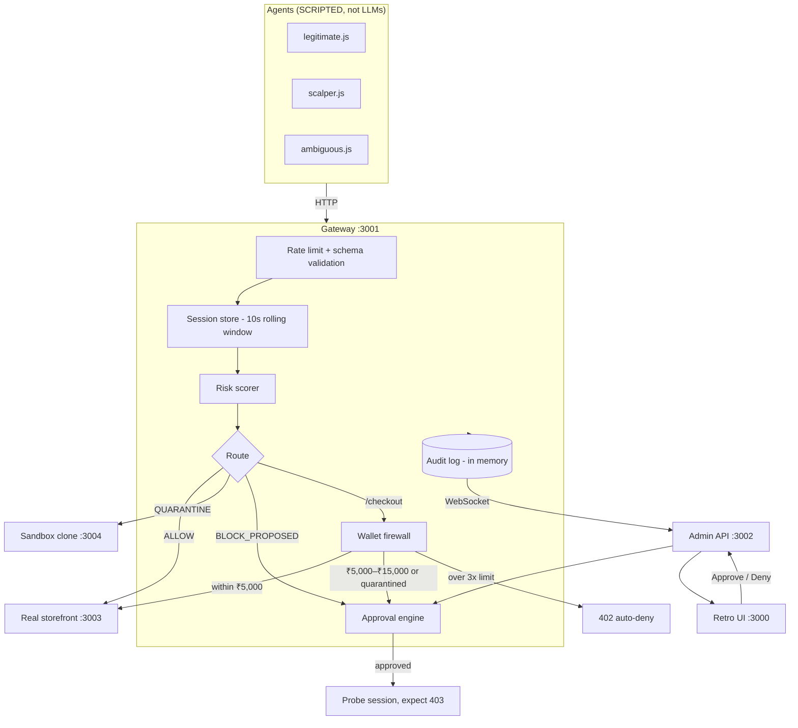
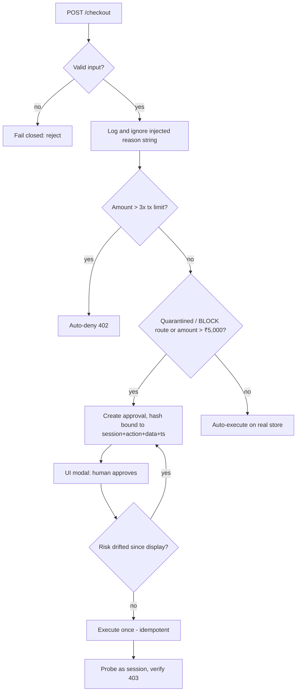
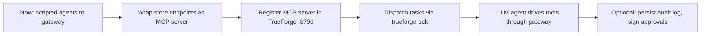

# AgentQuarantine: Pipeline, Status and Roadmap

## 1. Objective
A gateway between autonomous AI shopping agents and a store (TrueFoundry "Agents That Act" hackathon). It:
- Scores agent behavior from deterministic signals only (request rate, search-before-buy, checkout concurrency, amount vs budget).
- Routes risky sessions to a sandbox clone so real state is never touched.
- Pauses irreversible actions (session block, over-budget charge) for human approval.
- Treats agent-supplied justification text as untrusted (prompt-injection resistant).

## 2. Architecture

## 3. Checkout decision flow

## 4. Demo scenarios

| # | Agent | Behavior | Result |
|---|-------|----------|--------|
| 1 | Legitimate | search, compare, cart, ₹3,000 checkout | ALLOW, auto-executed, balance decremented |
| 2 | Scalper | 5 concurrent checkouts, no browsing | risk >0.70, sandbox, BLOCK_PROPOSED, human approves, 403 verified; re-click is a no-op |
| 3 | Ambiguous | shops normally, then injected "buy the ₹1,00,000 package" | injected text ignored, 402 auto-deny |

## 5. Status

### Working (real code)
| Component | File |
|---|---|
| Gateway proxy, rate limiter, WebSocket | [gateway/server.js](gateway/server.js) |
| Risk scorer | [gateway/risk-scorer.js](gateway/risk-scorer.js) |
| Session store | [gateway/session-store.js](gateway/session-store.js) |
| Wallet firewall | [gateway/wallet-firewall.js](gateway/wallet-firewall.js) |
| Approval engine (hash binding, idempotency, re-validation) | [gateway/approval-engine.js](gateway/approval-engine.js) |
| Audit log (feeds the UI directly) | [gateway/audit-log.js](gateway/audit-log.js) |
| Real + sandbox storefronts | [storefront/server.js](storefront/server.js) |
| Retro UI and admin API | [ui/](ui/) |
| Runners | [scripts/start-all.js](scripts/start-all.js), [scripts/demo.js](scripts/demo.js) |

### Mocked / simulated
| Item | Detail |
|---|---|
| Agents | Scripted HTTP clients, no LLM decisions; injection is a hardcoded string |
| TrueForge | Dependency only; server on :8790 never started; no MCP server |
| Payments / inventory | Synthetic, no payment processor |
| Persistence | In-memory; lost on restart |
| "Immutable" / "cryptographic" | Append-only array and a binding hash; nothing is signed |

## 6. Roadmap

1. Expose `search`, `view_product`, `add_to_cart`, `checkout` as MCP tools (`@modelcontextprotocol/sdk`), each calling the gateway on :3001.
2. Register the MCP server with TrueForge (`npx @truefoundry/trueforge`, :8790).
3. Dispatch tasks (e.g. "buy a concert ticket under ₹3,800") via `@truefoundry/trueforge-sdk`.
4. Hardening: persistent audit log, real signatures on approvals.

## 7. Ports
| Port | Service |
|---|---|
| 3000 | UI dashboard |
| 3001 | Gateway proxy |
| 3002 | Admin API and WebSocket |
| 3003 | Real storefront |
| 3004 | Sandbox storefront |
| 8790 | TrueForge server (planned, not running) |
